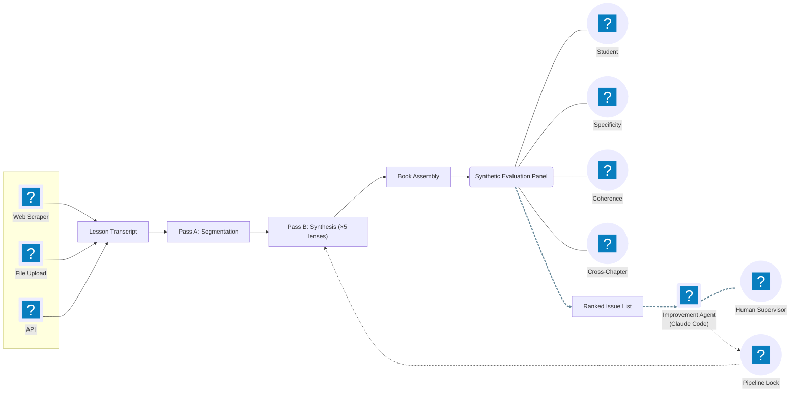

# Portfolio Case Study — Diagrams

## Diagram 1: End-to-End Pipeline Flow

```mermaid
flowchart LR
  %% SOURCES
  web@{ icon: fa:globe, form: square, label: "Web Scraper", h: 48 }
  file@{ icon: fa:file, form: square, label: "File Upload", h: 48 }
  api@{ icon: fa:cable-car, form: square, label: "API", h: 48 }

  transcript["Lesson Transcript"]

  %% SOURCE FAN-IN
  web --> transcript
  file --> transcript
  api --> transcript

  %% MAIN PIPELINE
  passA["Pass A: Segmentation"]
  passB["Pass B: Synthesis (×5 lenses)"]
  bookAssembly["Book Assembly"]

  transcript --> passA --> passB --> bookAssembly

  %% SYNTHETIC EVALUATION PANEL
  evalPanel@{ shape: rounded, label: "Synthetic Evaluation Panel" }
  bookAssembly --> evalPanel

  %% Critic "icons" in a row inside the panel (for visual cue—connect to panel via invisible links)
  student@{ icon: fa:user-graduate, form: circle, label: "Student", h: 30 }
  specificity@{ icon: fa:search, form: circle, label: "Specificity", h: 30 }
  coherence@{ icon: fa:link, form: circle, label: "Coherence", h: 30 }
  cross@{ icon: fa:layer-group, form: circle, label: "Cross-Chapter", h: 30 }

  evalPanel --- student
  evalPanel --- specificity
  evalPanel --- coherence
  evalPanel --- cross

  ranked["Ranked Issue List"]
  evalPanel --> ranked

  %% FEEDBACK LOOP
  improvement@{ icon: fa:robot, form: rounded, label: "Improvement Agent\n(Claude Code)", h: 48 }
  human@{ icon: fa:user, form: circle, label: "Human Supervisor", h: 30 }
  lock@{ icon: fa:lock, form: circle, label: "Pipeline Lock", h: 20 }

  ranked -.-> improvement
  improvement --- human
  improvement -.-> lock -.-> passB

  %% Add curve style and highlight the feedback loop
  linkStyle 11,12,13 stroke:#689,stroke-width:3px,stroke-dasharray: 6 3,color:#346

  %% Visually arrange sources
  subgraph Inputs[ ]
    direction TB
    web
    file
    api
  end
```

## Diagram 2: Improvement Iteration Loop

```mermaid
flowchart LR
    %% Timeline at the top
    timeline["<b>Iteration 4 — 12 min.</b>"]:::timeline
    classDef timeline fill:none,stroke:none,font-size:18px;

    %% Step 1: Review Summary / Issue selection
    review["Review Summary<br>
      <b><span style='color:#b91c1c;'>■</span> High: Inaccurate example</b> <span style='background:#fef08a;padding:0 5px;border-radius:3px;'>specificity</span><br>
      <b><span style='color:#f59e42;'>■</span> Medium: Vague transition</b> <span style='background:#cfe6fa;padding:0 5px;border-radius:3px;'>student persona</span><br>
      <b><span style='color:#a3e635;'>■</span> Low: Duplicate phrase</b> <span style='background:#e0e7ef;padding:0 5px;border-radius:3px;'>coherence</span><br>
      <span style='color:#d1d5db;'>■ Typo</span><br>
      <span style='color:#d1d5db;'>■ Minor layout</span><br>
      <br><i>Top 3 selected; others grayed out</i>
    "]:::reviewBox

    %% Step 2: Planning, human supervisor
    plan["Agent Plans Edits<br>
      <ul style='text-align:left;font-size:16px;'>
        <li><b>File:</b> lesson.md</li>
        <li><b>Section:</b> Example 2</li>
        <li><b>Change:</b> Add concrete scenario</li>
      </ul>
    "]:::editBox

    human((Human))
    approve["<i>approve / steer / halt</i>"]:::speech
    classDef speech fill:none,stroke:none,font-size:13px,color:#475569;

    %% Step 3: Implementation & lock
    implement["Agent Implements<br>
      <span style='background:#fee2e2;color:#b91c1c;'>- Inaccurate: The process is misunderstood.</span><br>
      <span style='background:#dcfce7;color:#166534;'>+ Corrected: Added concrete scenario for clarity.</span>
    "]:::editBox

    lockClosed((Pipeline locked<br/>background runner paused))

    %% Step 4: Rebuilds, only 3/40 nodes highlighted, lock open
    rebuild["Pipeline Rebuilds<br>
      <span style='color:#fde047;background:#fffbe5;padding:0 3px;'>3 of 40 nodes</span> highlighted<br>
      <span style='color:#d1d5db;'>Rest grayed out</span>
    "]:::rebuildBox
    lockOpen((Lock open))

    %% Step 5: Re-evaluate -- resolved/new, history chart
    reevaluate["Re-evaluate<br>
      <span style='text-decoration:line-through;color:#a3a3a3;'>Inaccurate example</span> <span style='color:#6366f1;'>&#10003;</span><br>
      <span style='text-decoration:line-through;color:#a3a3a3;'>Duplicate phrase</span> <span style='color:#6366f1;'>&#10003;</span><br>
      <span style='color:#eab308;'>New: Unbalanced section</span><br>
      <br>History: <b>11 → 8 → 5 → <span style='border:2px solid #38bdf8;border-radius:10px;padding:2px'>4</span></b>
    "]:::evalBox

    %% Circular flow arrows
    review --> plan
    plan -->|approved| implement
    human --- approve
    plan -.-> human
    implement --> lockClosed
    lockClosed --> rebuild
    rebuild --> lockOpen
    lockOpen --> reevaluate
    reevaluate -.->|Next Iteration| review

    %% Place timeline above steps
    timeline --- review

    %% Classes for steps
    classDef reviewBox fill:#f4f4f5,stroke:#0891b2,stroke-width:2px;
    classDef editBox fill:#fdf6e3,stroke:#eab308,stroke-width:2px;
    classDef rebuildBox fill:#f1f5f9,stroke:#f59e42,stroke-width:2px;
    classDef evalBox fill:#f0fdf4,stroke:#22d3ee,stroke-width:2px;

    %% Circular arrow style for the loop back
    linkStyle 8 stroke:#06b6d4,stroke-width:3px,stroke-dasharray:6 3;
```
